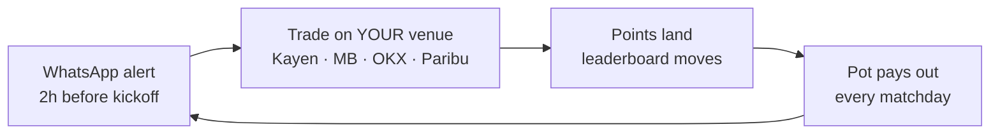

# Fan Token Trading League — Proposal v2

**One sentence:** Trade your club's token on match day, wherever you already trade — climb the leaderboard, take a share of a pot that grows every day.

**Design rule for everything below:** if a feature needs a paragraph to explain to a user, it doesn't ship in v1.

---

## The loop



That's the whole product. Everything else is engine room.

## The user's journey (five moments)

1. **Saturday, 14:00** — WhatsApp: "Fla-Flu tomorrow. Matchday pays 70,000 CHZ from the pot. You're 4,500 pts from the top 10."
2. They tap through: one page — the **pot** (big, counting up daily), the **leaderboard** (who's winning, what they've earned), the **next match**.
3. They trade MENGO on the venue they already use. Nothing to install, no funds to move to us.
4. **Full time** — WhatsApp: "Flamengo 2×1. You scored 2,140 pts — up to #87."
5. Sunday after the round: pot share lands in their wallet. Repeat next rodada.

Signup is once: log in with Socios ID, link where you trade (wallet signature or a read-only exchange key — two minutes). After that the league just counts.

## Scoring — one formula, everyone

```
Points = PnL% × (1 − e^(−Volume / V_target))
```

- **PnL%** — window cash-flow (sells − buys) plus mark-to-market of remaining inventory at score-time pool price, as % of capital deployed (buy USD).
- **Volume** — gross buy + sell USD in the window, plus net liquidity left in the pool (maker depth counts toward the unlock).
- **V_target** — single free parameter (default $1,000). At the target the multiplier is ≈ 63%; at 3× ≈ 95%.

Properties, stated in the rules and enforced in code:

- **Return first, volume unlocks** — flat wash has PnL% ≈ 0, so volume alone cannot buy the board (this is the fix for v1's additive `$Volume` term).
- **Per identity, not per wallet** — flows from every wallet one KYC identity owns are summed *before* the formula, so splitting the same flow across your own wallets can't farm the curve. Only verified identities divide the pool. (Residual case — two *distinct* colluding identities — is handled by manual review + flow-pattern clustering before payout, not by the formula alone.)
- **Liquidity has to stay** — net maker depth is clawed back if the liquidity is pulled within a cooldown after the whistle, so a mint-at-close/burn-after flash earns nothing toward the unlock.
- **No leverage in scope** — this build counts on-chain spot flow only, which is unlevered by nature; leveraged venues (perps/CEX) are counted later, always by collateral, never notional.
- **The scoring code is public** — anyone can recompute the on-chain leaderboard.

(Why not v1's `PnL% × 10,000 + $Volume`: $10k of churned volume costs ~$20 in fees and scores the same as doubling your money. Saturating volume as a *multiplier on PnL%* — not an additive term — kills that exploit while still rewarding real activity.)

## Battles = a televised match inside the league

Keep v1's format exactly — 2 KOL captains + 3 community traders per side, live-streamed during a marquee match window. But a battle is **not a second system**:

- Every battle member starts with the **same declared bankroll** (e.g. $5k). Highest combined team PnL at the final whistle wins the battle prize. No formula to explain — "same money, 90 minutes, who ends up ahead."
- Their trades earn **normal league points** at the same time, like anyone else's.
- **Captains win by making their squad win** — prize weight ×2 on the team result (applied once), never on their own PnL. That also removes the incentive to pump a thin token at their own audience.
- 70/30 winner/loser split kept from v1.

Battles are the acquisition spike; the league is where the viewers land. A battle without the open league underneath makes a great stream and zero lasting volume.

## Venues — the league counts, venues sponsor

| Where they trade | How we count it |
|---|---|
| Kayen (Chiliz Chain) | Automatically, on-chain |
| Mercado Bitcoin · OKX · Paribu · Binance | Read-only API key the user links once |
| Vibe · Socios app | Direct integration (Vibe has offered; one-page spec) |

No "which platform do we pick" decision — all of them, and they compete to sponsor matchday pools and offer rebates. CEX-vs-DEX pros/cons stop being our problem.

## Prizes

- **Season pot**: +10,000 CHZ/day from the Community Reserve + sponsor top-ups. Always visible, always growing — it *is* the homepage.
- **Matchday pools** paid weekly (the habit), season pot at the end (the grind).
- Battle prizes separate, ideally sponsor-funded.
- Club partnerships add non-cash prizes (signed shirts, experiences) — more football, less regulatory weight.

## Three rules we never break

1. **Points only for real, net trading.** No seed money to traders — ever. We fund prizes and rebates, not positions.
2. **No battle or featured match on a token too thin to absorb the audience.** Featured matches are hand-picked for depth today; a public depth threshold, checked on-chain at match creation, is the next build — it protects users from slippage and KOLs from pump accusations.
3. **Prizes follow points, never match predictions.** The league never pays out on sporting results. Skill competition, not betting.

## What we build (and what already exists)

The engine room — match calendar, real-time prices, Kayen indexing, odds and depth capture, the dashboard — already runs on Fan Token Intel infrastructure. New build: identity binding (Socios ID), exchange-key pollers, one scoring job, one leaderboard page. Working prototype of the league surface: **trading.brunopessoa.com** (PT/EN).

**Pilot (weeks, not months):** one battle on a Copa Libertadores knockout window in August. 10 participants onboarded manually, live leaderboard on stream. If the pilot works, open the league to everyone for the Brasileirão run-in; Champions League battles from March.

## v1's open questions — answered

| Question | Answer |
|---|---|
| Start mid-tournament? | Battles: yes, knockouts only. The league itself runs every rodada. |
| Seed funding? | No — rule #1. Prizes and rebates only. |
| Which platform? | All of them. The league counts; venues sponsor. |

---

*The league never executes trades, never holds funds, never recommends. It measures, scores, and pays.*
